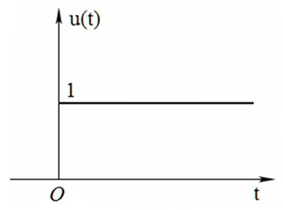
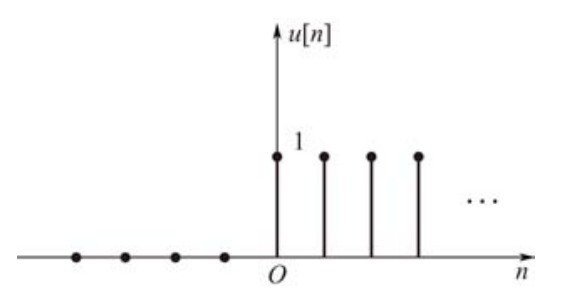
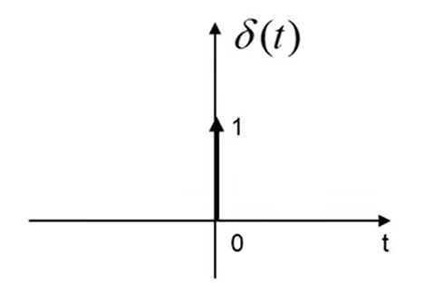
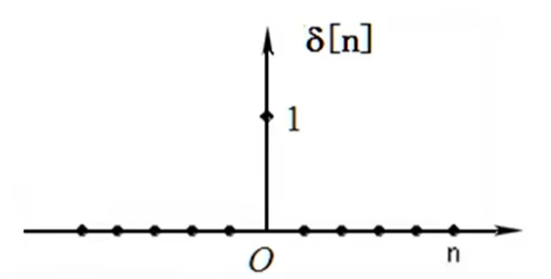
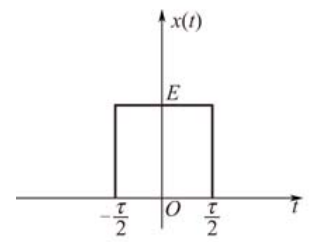
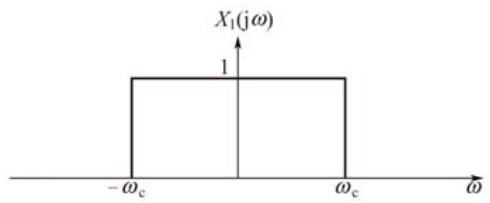
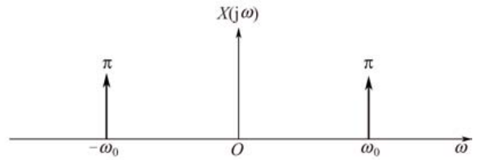
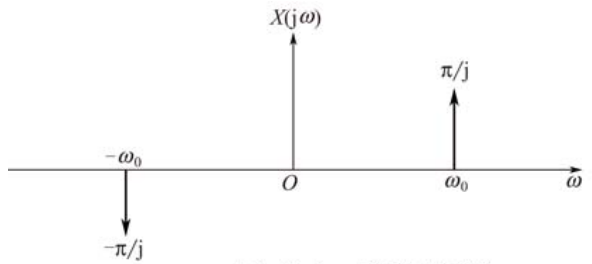
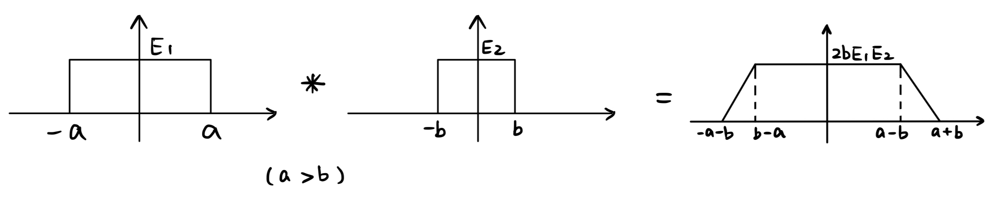
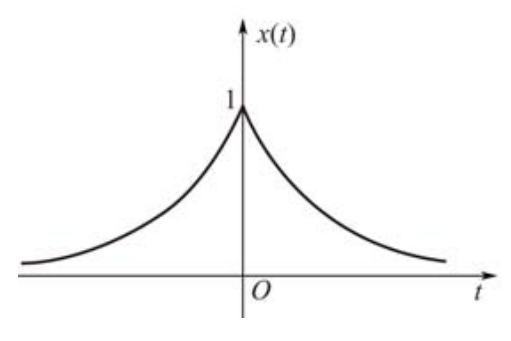

# 信号与系统 Signals and Systems

## 3. 典型的信号

### 信号

表达传递信息的符号. 

### 系统

有输入有输出. 

### 连续信号

$x(t)$ $(t\in \mathbb{R})$，$t$​​看作时间.

注意圆括号. 

### 离散信号

$x[n]$ $(n \in \mathbb{Z})$，$n$​看作序号.

注意方括号. 

### 周期信号

1. $x(t)=x(t+mT)$ $(m \in \mathbb{Z})$，$T$为最小正周期. 
2. $x[n]=x[n+mN]$ $(m \in \mathbb{Z})$，$N$​​​为自然数. 

### 奇信号

1. $x(t)=-x(-t)$
2. $x[n]=-x[-n]$

### 偶信号

1. $x(t)=x(-t)$
2. $x[n]=x[-n]$

### 信号基偶拆分

1. $x(t)=[\frac{x(t)+x(-t)}{2}]+[\frac{x(t)-x(-t)}{2}]=x_{even}(t)+x_{odd}(t)$​  
2. $x[n]=[\frac{x[n]+x[-n]}{2}]+[\frac{x[n]-x[-n]}{2}]=x_{even}[n]+x_{odd}[n]$​  

### 能量 $E$

1. $E=\int_{t_0}^{t_1} \left| x(t) \right|^2 \, dt$​ 
2. $E= \sum_{n=n_1}^{n=n_2} \left| x[n] \right|^2$​

能量（有限）信号：信号$x(t)$的能量$E$满足$0<E< \infty$，而$P=0$. 

### 功率 $P$

1. $P=\frac{1}{t_1-t_0}\int_{t_0}^{t_1} \left| x(t) \right|^2 \, dt$​

2. $P=\frac{1}{n_2-n_1+1} \sum_{n=n_1}^{n=n_2} \left| x[n] \right|^2$​

功率（有限）信号：信号$x(t)$的功率满足$0<P<\infty$，而$E=\infty$. 

### 单位阶跃信号 $u(t)$​

$u(t)= \begin{cases} 0 & t<0 \\ 1 & t>0 \end{cases}$

在跳变点$t=0$处无定义，$u(t)$​可以为任意值. 

### 单位阶跃序列 $u[n]$

$u[n]= \begin{cases} 0 & n<0 \\ 1 & n \geq 0 \end{cases}$

### 冲激信号 $\delta(t)$

$\delta(t)=\begin{cases} +\infty & t=0 \\ 0 & elsewise \end{cases}$​

$\int_{-\infty}^{+\infty} \delta(t) \,dt = 1$​

**与$u(t)$​​的关系**

$u(t)=\int_{-\infty}^{t} \delta(t) \,dt$
$\delta(t)=\frac{du(t)}{dt}$

由于$u(t)$在跳变点$t=0$处无定义，故上述式不能作为定义式. 

### 单位冲激序列 $\delta[n]$

$\delta[n]= \begin{cases} 0 & n \neq 0 \\ 1 & n=0 \end{cases}$​

### 抽样函数 $Sa(t)$

$Sa(t)=\frac{\sin(t)}{t}$ 或 $\sin c(t)=\frac{\sin(\pi t)}{\pi t}$，是偶函数.​

$Sa(t)=\frac{\sin(t)}{t}= \begin{cases} 1 & t=0 \\ \frac{\sin(t)}{t} & t \neq 0 \end{cases} $​

$\lim_{t \to 0} Sa(t) = 1$​

$\int_{0}^{+\infty} Sa(t) \,dt = \frac{\pi}{2}$

$\int_{-\infty}^{+\infty} Sa(t) \,dt = \pi$​

$\lim_{t \to 0} \frac{\sin(\omega t)}{t} = \omega$

$\int_{0}^{+\infty} \frac{\sin(\omega t)}{t} \,dt = \frac{\pi}{2}$ $(\omega > 0)$

$\int_{-\infty}^{+\infty} \frac{\sin(\omega t)}{t} \,dt = \pi$ $(\omega > 0)$

## 4. 信号的自变量变换

1. 化为标准形式.
2. 前有负号翻转.
3. 系数$>1$，压缩；系数$<1$​，拉伸. 
4. 加号左移；减号右移.

## 5. 典型的系统

### 线性系统 Linear System

#### 定义

1. 齐次性：若$\forall x(t)\longrightarrow y(t)$，则$\forall a\in \mathbb{R}$，有$ax(t)\longrightarrow ay(t)$ . 

2. 叠加性：若$\forall x_1(t)\longrightarrow y_1(t)$，且$\forall x_2(t)\longrightarrow y_2(t)$，则$x_1(t)+x_2(t)\longrightarrow y_1(t)+y_2(t)$​. 

#### 判据

1. 每一项都有$x$.
2. 每一项的$x$都是一次.

### 时不变系统 Time-Invariance System

#### 定义

若$\forall x(t)\longrightarrow y(t)$，则$\forall t_0 \in \mathbb{R}$，有$x(t-t_0)\longrightarrow y(t-t_0)$.

#### 判据

1. $t$只能在$x$的括号里.
2. $t$只能是$t$，不能是$2t$、$-2t$、$t^2$等其他函数.

### 因果系统 Causal System

#### 定义

系统任何时刻输出只决定于现在和过去的输入.

#### 判据

$x$括号里的数恒小于$y$括号里的数.

### 无记忆系统 Memoryless System

#### 定义

系统$y(t)$的值仅仅只依赖于$x(t)$的值.

#### 判据

$x$与$y$括号里的数完全一样.

无记忆系统一定是因果系统.

### 可逆系统 Invertable System

#### 定义

$x(t)$能唯一写成$y(t)$的形式.

叠加器、积分器可逆；微分器不可逆（存在常数$c$）.

### 稳定系统 Stable System

#### 定义

系统$x(t) \longrightarrow y(t)$，若$x(t)$*有界*，则$y(t)$*有界*.

*有界*：若$x(t)$有界，指$\exists M$，对$\forall t$，有$\left| x(t) \right| < M$.

[连续微分器（冲击响应）]、积分器、叠加器不稳定；[离散微分器]稳定.

### 示例

|                         | 线性 | 时不变 | 无记忆 | 因果 | 稳定 |
| ----------------------- | ---- | ------ | ------ | ---- | ---- |
| $y(t)=e^{x(t)}$         | ❌    | ✔      | ✔      | ✔    | ✔    |
| $y[n]=x[n]x[n-1]$       | ❌    | ✔      | ❌      | ✔    | ✔    |
| $y(t)=\frac{dx(t)}{dt}$ | ✔    | ✔      | ❌      | ✔*   | ❌    |

*左极限与右极限可判断出不同的结果，此处认为✔更合适.

## 6. 线性时不变（LTI）系统的定义

如果一个系统即线性又时不变，称作线性时不变系统，简称LTI系统. 

LTI是对现实问题的近似. 

如果我们知道LTI系统的一个$x(t)$对应的$y(t)$，那么我们就知道**所有**$x(t)$对应的$y(t)$. 

## 15. 傅里叶级数

### 标准形式

$x(t)=B_0+\sum_{k=1}^{+\infty}B_k\cos(k\omega_0t)+\sum_{k=1}^{+\infty}C_k\sin(k\omega_0t)$

$B_0=\frac{1}{T_0}\int_{T_0}x(t)\,dt$

$B_k=\frac{2}{T_0}\int_{T_0}x(t)\cos(k\omega_0t)\,dt$

$C_k=\frac{2}{T_0}\int_{T_0}x(t)\sin(k\omega_0t)\,dt$

### 复数形式

$x(t)=\sum_{k=-\infty}^{+\infty}a_ke^{jk\omega_0t}$

$a_k=\frac{1}{T_0}\int_{T_0}x(t)e^{-jk\omega_0t}\,dt$

$T_0=\frac{2\pi}{\omega_0}$

### 形式转换公式

$B_0=a_0\,(k=0)$
$B_k=a_k+a_{-k}\,(k\neq0)$
$C_k=j(a_k-a_{-k})\,(k\neq0)$
$a_0=B_0\,(k=0)$
$a_k=\frac{1}{2}(B_k-jC_k)\,(k\ge1)$
$a_{-k}=\frac{1}{2}(B_k+jC_k)\,(k\ge1)$

## 20. 傅里叶变换的定义

将傅里叶级数推广到非周期函数上，也可以理解为$T_0=+\infty$​.

$x(t)$时间域（时域） Time domain

$X(j\omega)$频率域（频域）Frequency domain

### 非周期函数$x(t)\in(-\infty,+\infty)$的傅里叶变换

#### 傅里叶变换

$X(j\omega)=\int_{-\infty}^{+\infty}x(t)e^{-j\omega t}\,dt$

#### 傅里叶反变换

$x(t)=\frac{1}{2\pi}\int_{-\infty}^{+\infty}X(j\omega)e^{j\omega t}\,d\omega$

$X(j\omega)$叫做$x(t)$的傅里叶变换.

#### 表示形式

$x(t)\xrightarrow{F}X(j\omega)$

$F[x(t)]=X(j\omega)$

$X(j\omega)\xrightarrow{F^{-1}}x(t)$

$F^{-1}[X(j\omega)]=x(t)$

## 21. 典型信号的傅里叶变换

| $x(t)$                                                       | $X(j\omega)$                                                 |
| ------------------------------------------------------------ | ------------------------------------------------------------ |
| $e^{-at}u(t)$                                                | $\frac{1}{a+j\omega} \, (a>0)$                               |
| $\delta(t)$                                                  | $1$                                                          |
| $1$                                                          | $2\pi\delta(\omega)$                                         |
|  | $E\,\tau \,Sa(\frac{\tau}{2}\omega) = \frac{2E\sin(\frac{\tau}{2}\omega)}{\omega}$ |
| $\frac{\sin(\omega_ct)}{\pi t}$                              |  |
| $\cos(\omega_0 t)$                                           | $\pi [\delta(\omega-\omega_0)+\delta(\omega+\omega_0)]$  |
| $\sin(\omega_0 t)$                                           | $\frac{\pi}{j} [\delta(\omega-\omega_0)-\delta(\omega+\omega_0)]$  |
| $u(t)$                                                       | $\frac{1}{j\omega}+\pi \delta(\omega)$                       |

## 22. 傅里叶变换的性质

### 线性性质

若$x_1(t)\xrightarrow{F}X_1(j\omega)$且$x_2(t)\xrightarrow{F}X_2(j\omega)$，则$ax_1(t)+bx_2(t)\xrightarrow{F}aX_1(j\omega)+bX_2(j\omega)$.

(同积分的线性性质)

### 时移性质

若$x(t)\xrightarrow{F}X(j\omega)$，则$x(t-t_0)\xrightarrow{F}X(j\omega)e^{-j\omega t_0}$.

### 频移性质

若$x(t)\xrightarrow{F}X(j\omega)$，则$x(t)e^{j\omega_0 t}\xrightarrow{F}X(j(\omega-\omega_0))$.

### 时域微分性质

若$x(t)\xrightarrow{F}X(j\omega)$，则$\frac{dx(t)}{dt}\xrightarrow{F}j\omega X(j\omega)$​.

### 频域微分性质

若$x(t)\xrightarrow{F}X(j\omega)$，则$tx(t)\xrightarrow{F}j\frac{dx(j\omega)}{d\omega}$.

### 时域卷积性质

若$x(t)\xrightarrow{F}X(j\omega)$，且$h(t)\xrightarrow{F}H(j\omega)$，则$x(t)*h(t)\xrightarrow{F}X(j\omega)H(j\omega)$.

$x(t)*h(t)=y(t)$

$X(j\omega)H(j\omega)=Y(j\omega)$​

$H(j\omega)$是冲激响应$h(t)$的傅里叶变换，也是LTI的系统函数. 

时域卷积等于频域相乘.

#### 用卷积性质重新考察LTI系统

时域：$x(t)\longrightarrow \fbox{$h(t)$} \longrightarrow y(t)=x(t)*h(t)$.

频域：$X(j\omega)\longrightarrow \fbox{$H(j\omega)$} \longrightarrow Y(j\omega)=X(j\omega)H(j\omega)$.

### 积分性质

若$x(t)\xrightarrow{F}X(j\omega)$，则$\int_{-\infty}^{t}x(\tau)\,d\tau = x(t)*u(t) \xrightarrow{F} X(j\omega)[\frac{1}{j\omega}+\pi\delta(\omega)] = \frac{X(j\omega)}{j\omega}+\pi X(0)\delta(\omega)$.

### 例：求微分器$H(j\omega)$

$y(t)=\frac{dx(t)}{dt}$

$h(t)=\frac{d\delta(t)}{dt}=\delta'(t)$

$H(j\omega)=j\omega$

### 例：求积分器$H(j\omega)$

$y(t)=\int_{-\infty}^{t}x(\tau)\,d\tau$

$h(t)=\int_{-\infty}^{t}\delta(\tau)\,d\tau = \begin{cases}1 & t>0 \\0 & t<0 \end{cases} =u(t)$

$H(j\omega)=\frac{1}{j\omega}+\pi\delta(\omega)$

### 例：求延时器$H(j\omega)$

$y(t)=x(t-t_0)$

$h(t)=\delta(t-t_0)$

$H(j\omega)=e^{-j\omega t_0}$

## 24. 傅里叶变换的调制性质

### 调制性质

若$x_1(t)\xrightarrow{F}X_1(j\omega)$，$x_2(t)\xrightarrow{F}X_2(j\omega)$. 则$x_1(t)x_2(t)\xrightarrow{F}\frac{1}{2\pi}X_1(j\omega)*X_2(j\omega)$​.

时域相乘等于频域卷积. 

### 卷积性质

若$x(t)\xrightarrow{F}X(j\omega)$，$h(t)\xrightarrow{F}H(j\omega)$. 则$x(t)*h(t)\xrightarrow{F}X(j\omega)H(j\omega)$. 

时域卷积等于频域相乘. 

### 卷积公式

$\int_{-\infty}^{+\infty}x(t)\,d(t)=X(j0)$

## 25. 信号的调制与解调

### 1. 信号的调制

$$
y(t)=x_1(t)\cos(\omega_{c1}t)+x_2(t)\cos(\omega_{c2}t)+\cdot \cdot \cdot \,+x_N(t)\cos(\omega_{cN}t)
=\sum_{i=1}^{N}x_i(t)\cos(\omega_{ci}t)
$$

（$x_i(t)$，$i=1\sim N$是$[-\omega_0,\omega_0]$的带限信号.）

### 2. 信号的解调

$$
x_i(t)=[y(t)\cos(\omega_{ci}t)]*\frac{2\sin(\omega_pt)}{\pi t}\,(i=1\sim N)
$$

（$\frac{2\sin(\omega_pt)}{\pi t}$为低通滤波器.）

### 限制条件

1. $\omega_0<\frac{\omega_{ci}-\omega_{cj}}{2}$
2. $\omega_0<\omega_p<\omega_{ci}-\omega_{cj}-\omega_0$且$\omega_0<\omega_p<2\omega_{ci}-\omega_0$.

## 26. 傅里叶变换的性质

### 1. 时间与频率尺度变换

若$x(t)\xrightarrow{F}X(j\omega)$，则$x(at)\xrightarrow{F}\frac{1}{\left|a\right|}X(j\frac{\omega}{a})$. 

#### 规律

时域胖$\xrightarrow{F}$频域瘦

时域瘦$\xrightarrow{F}$频域胖

### 2. 对偶性

若$x(t)\xrightarrow{F}X(j\omega)$，则$X(t)\xrightarrow{F}2\pi x(-\omega)$.

#### 例

$\delta(t)\xrightarrow{F}1\text{(针对$\omega$)}$

$1\text{(针对$t$)}\xrightarrow{F}2\pi\delta(-\omega)=2\pi\delta(\omega)$

由$\delta(at)=\frac{1}{\left|a\right|}\delta(t)$，得$\delta(\omega)=\delta(-\omega)$.

### 3. 帕斯瓦尔定理

若$x(t)\xrightarrow{F}X(j\omega)$，则$\int_{-\infty}^{+\infty}\left|x(t)\right|^2\,dt=\frac{1}{2\pi}\int_{-\infty}^{+\infty}\left|X(j\omega)\right|^2\,d\omega$

傅里叶变换能量守恒，等式左侧即能量公式. 

### 4.共轭与共轭对称性

1. 实偶$\xrightarrow{F}$实偶

   实奇$\xrightarrow{F}$虚奇

   由定义式：
   $$
   X(j\omega)=\int_{-\infty}^{+\infty}x(t)e^{-j\omega t}\,dt=\int_{-\infty}^{+\infty}x(t)\cos(\omega t)\,dt-j\int_{-\infty}^{+\infty}x(t)\sin(\omega t)\,dt
   $$
   若$x(t)$是实偶函数，则$X(j\omega)$只有$\cos$分量.

   若$x(t)$是实奇函数，则$X(j\omega)$只有$\sin$分量. 

2. 若$x(t)$是实函数，则$X(j\omega)$实部偶函数，虚部奇函数. 反之亦可. 
   $$
   x(t)=\frac{x(t)+x(-t)}{2}+\frac{x(t)-x(-t)}{2} \\
   \text{实偶}+\text{实奇} \\
   \downarrow F \\
   X(j\omega)=\text{Re}[X(j\omega)]+j\text{Im}[X(j\omega)] \\
   \text{实偶}+\text{虚奇}
   $$
   若$x(t)\xrightarrow{F}X(j\omega)$，且$x(t)$是实函数，则
   $$
   \frac{x(t)+x(-t)}{2}\xrightarrow{F}\text{Re}[X(j\omega)] \\
   \frac{x(t)-x(-t)}{2}\xrightarrow{F}j\text{Im}[X(j\omega)]
   $$

3. 实函数其傅里叶变换，幅度谱为偶函数，相位谱为奇函数. 

   幅度谱：$\left|X(j\omega)\right|=\sqrt{\text{Re}[X(j\omega)]^2+\text{Im}[X(j\omega)]^2}$

   相位谱：$\theta(\omega)=\arctan(\frac{\text{Im}[X(j\omega)]}{\text{Re}[X(j\omega)]})$​

## 29. 二维信号的傅里叶变换

### 对比：一维信号

$$
X(j\omega)=\int_{-\infty}^{+\infty}x(t)e^{-j\omega t}\,dt \\
x(t)=\frac{1}{2\pi}\int_{-\infty}^{+\infty}X(j\omega)e^{j\omega t}\,d\omega
$$

### 二维信号

傅里叶变换：$F(u,v)=\int_{-\infty}^{+\infty}\int_{-\infty}^{+\infty}f(x,y)e^{-j(ux+vy)}\,dxdy$

幅度谱：$\left|\left|F(u,v)\right|\right|=\sqrt{\text{Re}[F(u,v)]^2+\text{Im}[F(u,v)]^2}$

相位谱：$\theta(u,v)=\arctan(\frac{\text{Im}[F(u,v)]}{\text{Re}[F(u,v)]})$​

傅里叶反变换：$f(x,y)=\frac{1}{4\pi^2}\int_{-\infty}^{+\infty}\int_{-\infty}^{+\infty}F(u,v)e^{j(ux+vy)}\,dudv$

#### 注

二维的$u,v$相当于一维的$\omega$. 

## 30. 四个不常用的傅里叶变换

|              | $x(t)$                 | $x(t)$                                                       | $X(j\omega)$              |
| ------------ | ---------------------- | ------------------------------------------------------------ | ------------------------- |
| 双边指数信号 | $e^{-a\left|t\right|}$ |  | $\frac{2a}{a^2+\omega^2}$ |
|              |                        |                                                              |                           |
|              |                        |                                                              |                           |
|              |                        |                                                              |                           |

------

  

© 2024 [Zhe Wang](mailto:me@wuff.dog)
